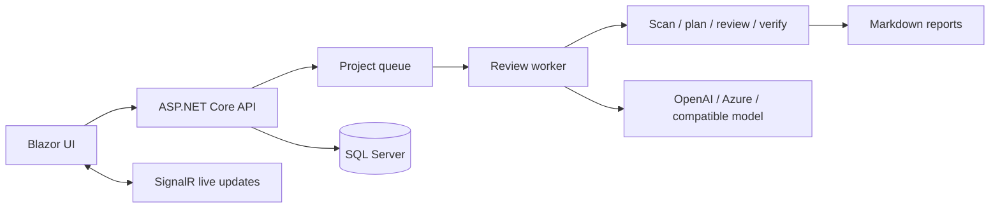
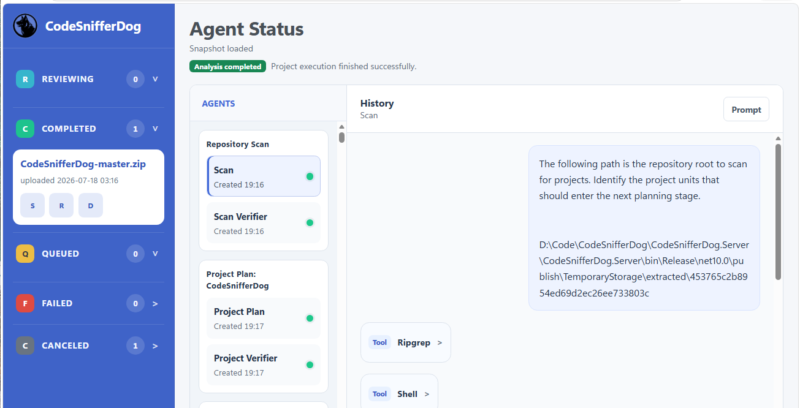
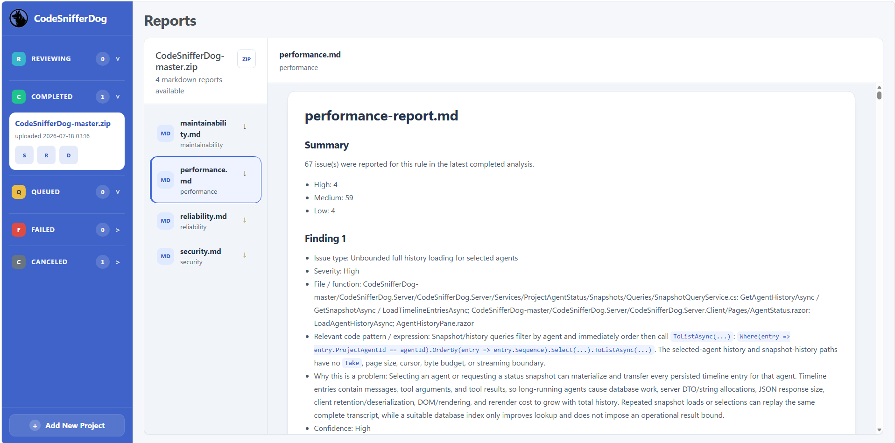

# CodeSnifferDog
[](https://deepwiki.com/ChengYen-Tang/CodeSnifferDog)

CodeSnifferDog is a self-hosted, AI-assisted code review platform. Upload a zipped repository, let a staged set of agents inspect it against configurable engineering rules, and follow the review from the browser.

## What it does

- Uploads a `.zip` repository and runs it through a queued review workflow.
- Scans the project, plans the review, evaluates rules, verifies findings, and produces Markdown reports.
- Supports OpenAI, Azure OpenAI, and OpenAI-compatible backends such as CPA, vLLM, SGLang, and Ollama.
- Loads review rules from customizable Markdown templates in `CodeSnifferDog/rules/`.
- Shows agent status, tool activity, retries, failures, and context-compaction events while work is running.
- Keeps project state in SQL Server and exposes live updates through SignalR.



## Screenshots

### New Project


### Agent Status



### Reports



## Quick start

Prerequisites:

- .NET 10 SDK
- SQL Server (the development settings use SQL Server LocalDB)
- An inference provider reachable by the server

```powershell
git clone https://github.com/ChengYen-Tang/CodeSnifferDog.git
cd CodeSnifferDog
dotnet restore CodeSnifferDog.slnx
dotnet build CodeSnifferDog.slnx
dotnet test CodeSnifferDog.slnx
dotnet run --project CodeSnifferDog.Server/CodeSnifferDog.Server/CodeSnifferDog.Server.csproj --launch-profile http
```

Open the HTTP URL printed in the server console, configure the provider first, and upload a `.zip` repository. The actual host and port come from the selected ASP.NET Core launch profile or deployment configuration. The server applies pending EF Core migrations at startup.

## Customize review rules

The review worker reads every non-empty, top-level `.md` file in [`CodeSnifferDog/rules/`](CodeSnifferDog/rules/). Replace the supplied files or add your own Markdown files to tailor the checks to your project. The file name becomes the rule name used in the review and report.

Provided templates:

- [Maintainability](CodeSnifferDog/rules/maintainability.md)
- [Performance](CodeSnifferDog/rules/performance.md)
- [Reliability](CodeSnifferDog/rules/reliability.md)
- [Security](CodeSnifferDog/rules/security.md)

When running a published build, edit the corresponding `rules/` folder beside the application executable. See the [configuration guide](docs/configuration.md#review-rules) for the loading behavior and deployment notes.

## Documentation

| Guide | Contents |
| --- | --- |
| [Getting started](docs/getting-started.md) | Prerequisites, setup, and the first review |
| [Configuration](docs/configuration.md) | Inference providers, execution limits, secrets, and environment variables |
| [User guide](docs/user-guide.md) | UI workflow, statuses, agent timeline, and reports |
| [HTTP API](docs/api.md) | Project endpoints, upload examples, and live updates |
| [Architecture](docs/architecture.md) | Runtime components and review data flow |
| [Deployment](docs/deployment.md) | Publishing, runtime data, operations, and security |

## Repository layout

| Path | Responsibility |
| --- | --- |
| `CodeSnifferDog/` | Agent workflows, tools, rules, prompts, and context compaction |
| `CodeSnifferDog.Server/` | ASP.NET Core host, persistence, queue, workers, API, and SignalR |
| `CodeSnifferDog.Tests/` | Unit, component, workflow, architecture, and integration-oriented tests |

For configuration and operational details, start with the [configuration guide](docs/configuration.md) and [deployment guide](docs/deployment.md).
