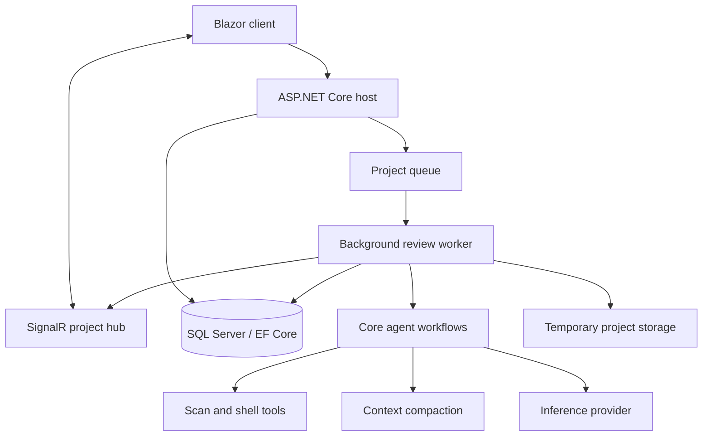

# Architecture

CodeSnifferDog separates the browser experience, project API, durable state, and agent workflow so a review can continue as a long-running background operation.

## Main projects

| Project | Responsibility |
| --- | --- |
| `CodeSnifferDog/` | Agent workflows, prompts, rules, tools, models, and context preparation/compaction |
| `CodeSnifferDog.Server/CodeSnifferDog.Server/` | ASP.NET Core host, API endpoints, EF Core persistence, queue, worker, and SignalR hub |
| `CodeSnifferDog.Server/CodeSnifferDog.Server.Client/` | Blazor UI for project navigation, status, and reports |
| `CodeSnifferDog.Server/CodeSnifferDog.Server.Shared/` | Contracts shared between the server and client |
| `CodeSnifferDog.Tests/` | Unit, component, workflow, architecture, and integration-oriented tests |

## Review execution

An upload creates a project record and places work on the bounded queue. A background worker coordinates scan, planning, rule review, verification, and report persistence. Agent attempts are cancellation-aware and subject to configured timeouts and retry limits.

Agent context preparation runs before model calls and checks the configured context budget. When the automatic compaction threshold is reached, the worker compacts the operational context and records the event in the project timeline before continuing with the next call.

Tool calls and results are persisted as status history and broadcast through SignalR. This gives the UI a recoverable timeline instead of depending on one continuous browser connection.

## Extensibility boundaries

- Add or change review behavior in the core workflows and rule/prompt assets.
- Add provider-specific request fields through the inference configuration rather than coupling workflows to one vendor.
- Keep API/client contracts in the shared project so the server and Blazor client evolve together.
- Keep worker concurrency and model-context budgets in configuration; do not assume that more parallel agents improve throughput for every provider.
